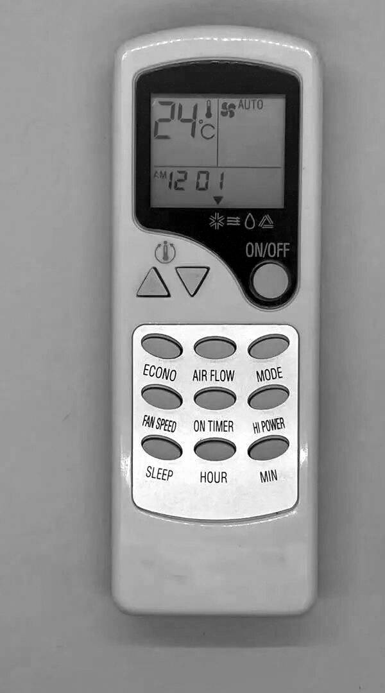
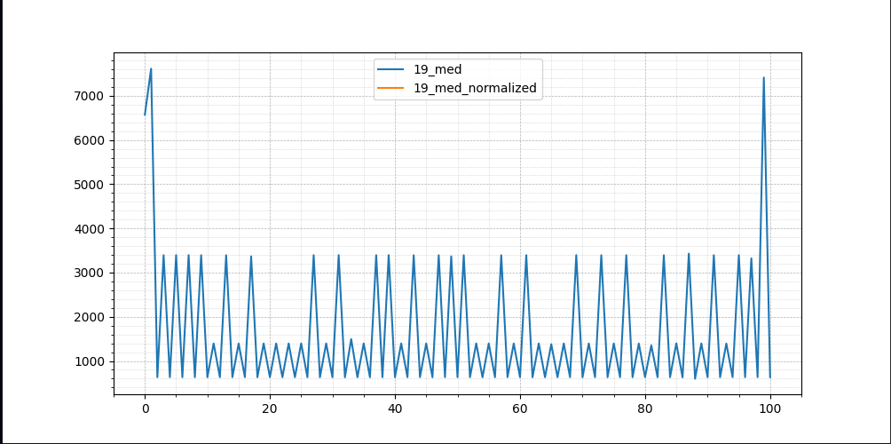
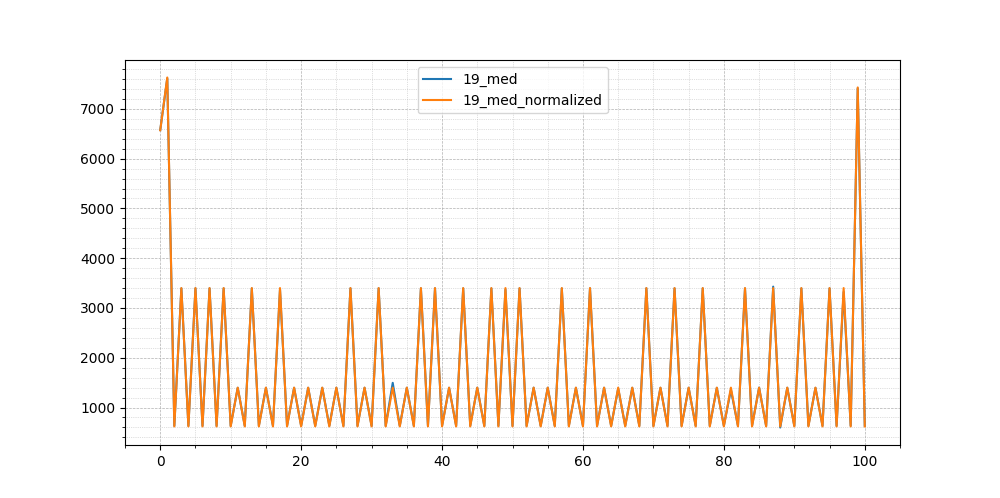

# Preface

This document is a result of observation of what an AirCo remote control sends to the indoor AirCo unit. 
It's a personal hobby project.

## Disclaimer

By using this document and any associated data and files from this project, you agree to assume all risks associated with its usage. This project is intended for educational purposes only. You must own all the equipment you use with this project, and it is your responsibility to ensure that your actions comply with all applicable laws and regulations.

If you use this project in any way that violates the law or infringes upon the rights of others, it is solely your liability, and the responsibility for any potential consequences, legal or otherwise, rests entirely with you. The creator of this project and its documentation cannot be held responsible for any illegal or unethical use of the project or for any resulting damages, including but not limited to hardware damage, data loss, or legal action.

Additionally, it is important to note that all trademarks, trade names, or product names mentioned within this project and its documentation belong to their respective owners. The use of these trademarks is for descriptive and educational purposes only and does not imply any endorsement, sponsorship, or affiliation with this project. All trademarks are the property of their respective trademark owners, and any references to them within this project should be considered as such.


# Chigo AirCo IR protocol description

## Data files:
- `IR-data` --  all the known IR signals in Flipper Zero format
- `hex-data` -- all the known Remote Control commands in hex format


## Table of contents
- Hardware 
- Switching the AirCo on
- IR-signal format (analog)
  - Raw IR signal 
  - Normalised IR signal
  - Interpretation of the signal
-  Command format (digital)
  - Command example
  - Command validation
- Naming conventions
- Codes that a command consists of
  - Speed and power levels
  - COOL MODE, Temperature values
  - FAN MODE, Temperature values
  - DRY MODE, Temperature values
  - AUTOMATIC MODE, Level values
  - MANUFACTURER / DEVICE ID (?)
-  Switching the AirCo off
  -  The 'switch-off' commands
-  Timer

## Hardware 
- Remote control: **ZC/LW-03**
- Model of the indoor unit: **Chigo KF-25GW/Xc** (from year 2006)
- **Flipper Zero**

 
**Chigo ZC/LW-03 Remote Control:**

  

The indoor unit does not seem to keep its state.
It does not seem to remember what the last command was or in what mode runs at a given moment. It simply switches to a mode/state specified by a command  incoming from the Remote Control.

##  Switching the AirCo on
There is no single 'switch-on' command. The unit powers up and starts functioning once it receives any of the mode switching commands described in this document.

##  IR-signal format (analog)

Below is an example of raw IR-data emitted by the Remote Control (RC) and captured by Flipper Zero. The values captured originally fluctuated around some base points. For the simplicity of processing and manipulating the signal all the fluctuations were normalised, i.e. replaced with some sane average values.


### Raw IR signal 
This is what the raw IR data captured by Flipper Zero looks like.
In this case it is command `F50A 6B94 54AB`  which enables Cool mode, 19°C, at medium speed.

```
# 
name: 19_med
type: raw
frequency: 38000
duty_cycle: 0.330000
data: 6573 7613 634 3394 634 3395 633 3395 633 3394 634 1397 634 3393 635 1396 635 3368 633 1397 634 1397 634 1397 634 1398 633 3395 633 1398 633 3396 632 1496 633 1398 633 3394 634 3395 633 1397 634 3393 635 1398 633 3393 635 3367 634 3394 634 1399 632 1398 633 3393 635 1397 634 3395 633 1398 633 1380 634 1397 634 3396 632 1397 634 3394 634 1397 634 3394 634 1396 635 1354 633 3393 635 1400 631 3429 599 1398 633 3394 634 1396 635 3394 634 3322 635 7413 635
```
  
This is what the analog signal looks like visualised:



### Normalised IR signal
This is what the same IR signal for command `F50A 6B94 54AB`  looks like after normalisation:

``` 
# 
name: 19_med_norm
type: raw
frequency: 38000
duty_cycle: 0.330000
data: 6570 7630 620 3400 620 3400 620 3400 620 3400 620 1400 620 3400 620 1400 620 3400 620 1400 620 1400 620 1400 620 1400 620 3400 620 1400 620 3400 620 1400 620 1400 620 3400 620 3400 620 1400 620 3400 620 1400 620 3400 620 3400 620 3400 620 1400 620 1400 620 3400 620 1400 620 3400 620 1400 620 1400 620 1400 620 3400 620 1400 620 3400 620 1400 620 3400 620 1400 620 1400 620 3400 620 1400 620 3400 620 1400 620 3400 620 1400 620 3400 620 3400 620 7430 620
```
  
And here is the normalised signal visualised atop of the original raw signal:


### Interpretation of the signal
I'll use only the normalised signal data from now on.

- `6570 7630` in the beginning of the signal is a sync pulse. It indicates the beginning of the command.
- `620` stands for `undefined` (or distance between binary values)
- `1400` -- binary zero
- `3400` -- binary one
- `7430 620` in the end of the signal is the end of signal marker. It indicates that all the data has been transferred.


##  Command format (digital)
The rest of this document is about interpreting the data encoded with binary zeroes (`1400` ) and ones (`3400`).
The sync pulse and the end marker are the same for every command.

The sequence of `1400` and `3400` in the normalised example above translates into the following binary code:
```
    11110101 00001010 01101011 10010100 01010100 10101011
```
  
I'll use hex representation of the same bits as it's much easier on the eye.
So we have:
```
    F50A 6B94 54AB
``` 

A command consists of 48 bits arranged into 3 fields of 16 bits each:
1. bits 00-15: a mode in which the AirCo unit should operate
2. bits 16-31: a numeric value within that mode (e.g. speed)
3. bits 32-47: a constant: `54AB`. Probably a manufacturer/device identifier.

### Command example


Command `F50A 6B94 54AB` activates cooling mode at 19°C at medium speed of the fan.

`F50A` means medium speed level (there also high and low speed levels)
`6B94` means Cooling mode at 19°C.
`54AB` can be safely ignored as it is always the same. 


### Command validation
Each field contains two bytes. The first 8 bits equal the last 8 bits inverted.
Here's the command `F50A 6B94 54AB` broken down into individual bytes and their binary representations:

```
-----+----------
 HEX | BINARY
-----+----------
  F5 | 11110101
  0A | 00001010
-----+----------
  6B | 01101011
  94 | 10010100
-----+----------
  54 | 01010100
  AB | 10101011
-----+----------
```
So if I invert bits of `F5` , I get `A0`, etc.

This redundancy is likely to be used to validate incoming commands.
Most likely the AC indoor unit takes every first byte of each field, inverts it and compares to the second byte of the corresponding field.
If  at least 1 field does not pass this validation, the received command is ignored.


## Naming conventions
Flipper Zero displays just the first few letters of a signal name, so in order
to make all the buttons readable on the screen, the following naming scheme was used:

- `au` -- Auto speed
- `hi` -- High speed
- `me` -- Medium speed
- `lo` -- Low speed
- `HP` -- High Power 
- `EC` -- Economy (low power)
- `1f` -- Air flow: Mode "1/f"
- `ar` -- Air flow: automatic rotation of the louver

These short names are also combined.

If a number is prepended with `_` that means a minus (Flipper Zero does not seem to like the actual `-` character).

**Here are some examples explained:**

- `_4_au`   -- level -4, automatic speed.
- `2_me_ar` -- level +2, medium speed, air flow: auto rotation of the louver.
- `_6_HP_1f`-- level -6, High Power, air flow: Mode "1/f".
- `20_EC`   -- temp 20°C, Economy.
- `28_HP_ar`-- temp 28°C, High Power, air flow: auto rotation of the louver.
- `21_lo_1f`-- temp 21°C, low speed, air flow: Mode "1/f".


##  Codes that a command consists of

A command can be assembled from the values described in sections in the rest of this document. 

Here's the algorithm:

1. Pick a value from **Speed and power levels** section
2. Choose a mode you want to activate: **Cool**, **Fan**, **Dry** or **Auto**
3. Within that mode pick a value for desired temperature (or level in case of mode **Auto**)
4. Combine the values from **1.** and **3.**
5. Append the Device ID value.

Let's assemble a command for activating **High speed, Cool mode at 22°C**:
```
F30C .... ....        // hi -- high speed
+
.... 659A ....        // 22°C
+
.... .... 54AB        // remains constant in all the commands.
=
F30C 659A 54AB        
```
So in order to enable Cool mode at 22°C at High speed we need to send `F30C 659A 54AB`  to the indoor unit.


### Speed and power levels
The first 2 bytes of each command encode a speed or power mode:

```
F708 .... .... // au -- auto speed
F30C .... .... // hi -- high speed
F50A .... .... // me -- medium speed
F10E .... .... // lo -- low speed
F609 .... .... // HP -- High Power
F20D .... .... // EC -- Economy
FF00 .... .... // au_1f -- auto speed, air flow: Mode "1/f". 
EF10 .... .... // au_ar -- auto speed, air flow: auto rotation of the louver.
FB04 .... .... // hi_1f
EB14 .... .... // hi_ar
FD02 .... .... // me_1f
ED12 .... .... // me_ar
F906 .... .... // lo_1f 
E916 .... .... // lo_ar -- low speed, air flow: auto rotation of the louver.
FE01 .... .... // HP_1f
EE11 .... .... // HP_ar
FA05 .... .... // EC_1f -- Economy, air flow: Mode "1/f". 
EA15 .... .... // EC_ar
```
  


### COOL MODE
- Icon on the RC: a snowflake
In Cool mode the second 2 bytes of each command encode a temperature.
#### Temperature values:
```
.... 6798 .... 18°C
.... 6B94 .... 19°C
.... 639C .... 20°C
.... 6D92 .... 21°C
.... 659A .... 22°C
.... 6996 .... 23°C
.... 619E .... 24°C
.... 6E91 .... 25°C
.... 6699 .... 26°C
.... 6A95 .... 27°C
.... 629D .... 28°C
.... 6C93 .... 29°C
.... 649B .... 30°C
```
  

### FAN MODE
- Icon on the RC: 3 horizontal waves
In Fan mode the second 2 bytes of each command encode a temperature.
#### Temperature values:
```
.... 27D8 .... 18°C
.... 2BD4 .... 19°C
.... 23DC .... 20°C
.... 2DD2 .... 21°C
.... 25DA .... 22°C
.... 29D6 .... 23°C
.... 21DE .... 24°C
.... 2ED1 .... 25°C
.... 26D9 .... 26°C
.... 2AD5 .... 27°C
.... 22DD .... 28°C
.... 2CD3 .... 29°C
.... 24DB .... 30°C
```
  

### DRY MODE
- Icon on the RC: A drop of water
In Dry mode the second 2 bytes of each command encode a temperature.
#### Temperature values:
```
.... A758 .... 18°C
.... AB54 .... 19°C
.... A35C .... 20°C
.... AD52 .... 21°C
.... A55A .... 22°C
.... A956 .... 23°C
.... A15E .... 24°C
.... AE51 .... 25°C
.... A659 .... 26°C
.... AA55 .... 27°C
.... A25D .... 28°C
.... AC53 .... 29°C
.... A45B .... 30°C
```  

```
===============================================================================
‼️ Please do not emit High-Power commands in Dry mode!
   The original remote control does not allow that. 
   I assume that High-Power commands in Dry mode might damage the AC.
==============================================================================
```
 
### AUTOMATIC MODE
- Icon on the RC: A triangle with double border
In automatic mode some other units are used, not degrees Celsius.
The range begins at -6 and ends with +6. Below are the identifiers for each level. Since `-` character does not seem to be available on Flipper Zero by default, a notation of 'underscore + number' is used to mark negative numbers.

I.e. -6 is represented with `_6`.
#### Level values:
```
.... E718 .... _6 // level -6
.... EB14 .... _5 // level -5
.... E31C .... _4
.... ED12 .... _3
.... E51A .... _2
.... E916 .... _1
.... E11E ....  0 // level 0
.... EE11 ....  1
.... E619 ....  2
.... EA15 ....  3
.... E21D ....  4
.... EC13 ....  5 // level +5
.... E41B ....  6 // level +6
```

### MANUFACTURER / DEVICE ID (?)
The last 2 bytes of each command are most likely an identifier of the device, so that the receiving end could ignore commands of the same format for some other device in the same room but with a different ID.
```
.... .... 54AB // remains constant in all the commands.
```

##  Switching the AirCo off
Peculiar enough, there are many commands for switching off the AC indoor unit.
There is an individual 'switch off' command per mode (Cool, Fan, Dry, Auto) and temperature (level in case of mode Auto).
I suspect that the AC indoor unit needs to deactivate certain internal functions upon switching off. 
Those functions are probably mode-specific, hence  many commands. E.g. if the louver is swinging, it needs to be parked into a safe position when powering off.

```
===============================================================================
‼️ Please use a 'switch off' command that corresponds to the mode,
   speed, airflow, etc. that the AC indoor unit is operating under 
   in order to avoid damaging the unit.
===============================================================================
```

There are also 'switch off' commands per temperature/level in the Economy mode, however, the RC does not seem to emit a dedicated 'switch off' command for High-Power mode.
It sends a command for the mode in which the unit had been right before the High-Power 
mode was activated.

```
===============================================================================
‼️ Please do not try to combine High-Power mode with switch-off command codes. 
   There must be a good reason why the RC does not emit such commands.
   We suspect that sending such a command might damage the AC hardware 
   but we did not have a spare AC unit to test it on.
===============================================================================
```

###  The 'switch-off' commands

Example: here are commands for switching **medium speed, Cool mode at 18°C** of and off:
```
F50A 6798 54AB  // on
F50A 7788 54AB  // off
```

The difference is in the second pair of bytes: 
`6798` vs `7788`

To get a 'power-off' version of any command (except the High-Power commands), we need to increase the first byte of the mode code by `0x10` and decrease the second byte by `0x10`.


##  Timer

The AC unit has a built-in timer which can be programmed from the RC.
The timer commands are longer (e.g. `DE21 BF40 FF00 BA45 EA15 54AB`) and they are outside of the scope of this research.